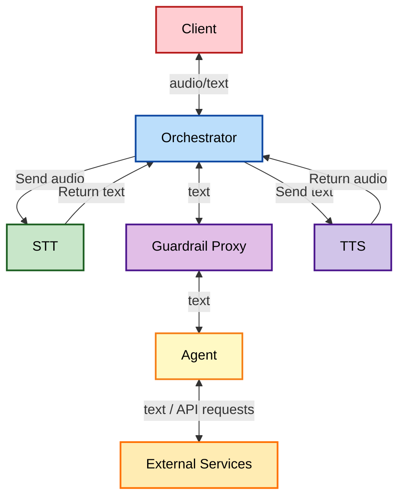
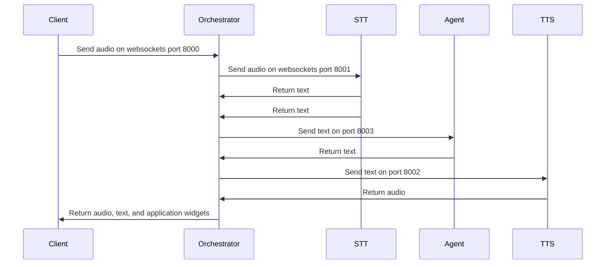

# xRx [](https://opensource.org/licenses/Apache-2.0)

Build apps with "any modality input (x), reasoning (R), any modality output (x)." 

## Introduction

xRx is a framework for building AI-powered reasoning systems that interact with users across multiple modalities, where "x" represents the flexible integration of text, voice, and other interaction forms. 

We believe that the future of software interactions lies in multimodal experiences, and xRx is at the forefront of this movement. It enables developers to build sophisticated AI systems that seamlessly integrate various input and output modalities, providing users with a truly immersive experience.

## Overview 
xRx is a set of building blocks for developers looking to build next-generation AI-powered user experiences. Whether you're developing voice-based assistants, text-based chatbots, or multimodal applications, xRx provides the building blocks you need.

## Key Features

- **Multimodal Input and Output**: Integrate audio, text, and other modalities effortlessly.
- **Advanced Reasoning**: Utilize comprehensive reasoning systems to enhance user interactions.
- **Modular Architecture**: Easily extend and customize components to fit your specific needs.

<details>
<summary><strong>System Architecture</strong></summary>

The xRx system is composed of several key components, each playing a crucial role in delivering a seamless multimodal experience.



### High-Level Architecture

- **Client**: Front end app experience which renders the UI and handles websocket communication with the Orchestrator. [Client Directory](./nextjs-client)
- **Orchestrator**: Manages the flow of data between various AI and traditional software components. [Orchestrator Directory](./orchestrator)
- **STT (Speech-to-Text)**: Converts audio input to text. [STT Directory](./stt)
- **TTS (Text-to-Speech)**: Converts text responses back to audio. [TTS Directory](./tts)
- **Agent**: A collection reasoning agents responsible for the "reasoning" system of xRx. [Reasoning Directory](./reasoning)
- **Guardrails Proxy**: A safety layer for the reasoning system. [Guardrails Proxy Directory](./guardrails-proxy)

These components then communicate via the following sequence diagram


---

</details>
<details>
<summary><strong>Reasoning Systems</strong></summary>

To showcase the capabilities of xRx, we've created multiple reasoning systems:

### Simple Tool Calling Agent

We've created a simple tool calling agent that demonstrates basic functionality. This agent has access to tools like weather and time retrievers, and stock price lookup. It shows how any Python-based reasoning agent can be deployed into the xRx system. The code for this reasoning agent can be found [here](./reasoning/simple-agent).

### Shopify Interaction Agent

We have built a sophisticated reasoning system that interacts with a Shopify store. The [shopify-agent](./reasoning/shopify-agent) allows users to interact with a reasoning system built on top of Shopify, handling tasks like product inquiries, order placement, and customer service.

### Wolfram Assistant Agent

The [wolfram-assistant-agent](./reasoning/wolfram-assistant-agent) leverages Wolfram Alpha's conversational API to provide answers to user queries, particularly useful for mathematical and scientific questions. This agent enhances the dialogue with refined language processing to deliver a smooth and engaging user experience.

### Patient Information Agent

The [patient-information-agent](./reasoning/patient-information-agent) is designed to collect and manage patient information before a doctor's visit. It demonstrates how xRx can be applied in healthcare scenarios, gathering essential medical data in a conversational manner.

### Template Agent

For developers looking to create their own reasoning agents, we provide a [template-agent](./reasoning/template-agent). This serves as a starting point for developing new reasoning agents within the xRx framework, offering a basic structure that can be easily customized and extended.

Each of these agents showcases different aspects of the xRx system's capabilities, from simple tool integration to complex domain-specific interactions. They demonstrate the flexibility and power of the xRx framework in building sophisticated AI-powered user experiences across various domains.
</details>

<details>
<summary><strong>Getting Started</strong></summary>

### Prerequisites

To deploy xRx locally, you need the following components:
- [Docker](https://www.docker.com/get-started)
- [Python](https://www.python.org/downloads/) (version 3.10)
- [Node](https://nodejs.org/en/download/) (version 18)
- [Pip](https://pip.pypa.io/en/stable/installing/)

```bash
brew cask install docker
brew install python@3.10
brew install node@18
```

### External Services Configuration

xRx requires three external services: LLM, Text-to-Speech, and Speech-to-Text. Configure these services by setting the environment variables in the `.env` file at the root of the repository.

#### LLMs

We recommend Groq for high token throughput. Sign up at [Groq](https://console.groq.com/docs/quickstart) and obtain an API key.

```
LLM_API_KEY="<your Api Key>"
LLM_BASE_URL="https://api.groq.com/openai/v1"
LLM_MODEL_ID="llama3-70b-8192"
```

We recommend the models in the variables above for our repository, but they can be changed to any model that is supported by the LLM provider.

#### Text to Speech

We use Elevenlabs for text-to-speech. Sign up at [Elevenlabs](https://elevenlabs.io/app/sign-up) and obtain an API key.

```
ELEVENLABS_API_KEY=<your elevenlabs api key>
ELEVENLABS_VOICE_ID=<your elevenlabs voice id>
```

#### Speech to Text

We support multiple transcription services. For ease, use Groq's Whisper, given that you already have an API key.

```
STT_PROVIDER="groq"
GROQ_STT_API_KEY="<your groq api key>"
```

### How To Run with a Simple Agent

1. Create a `.env` file with content at the root (`./`) See [env.quickstart](config/env-examples/env.quickstart) for an example of what this environment file should look like.

2. Build and run the system using Docker:

```bash
docker-compose up --build
```

3. Visit the xRx Demo client at [http://localhost:3000](http://localhost:3000)

Enjoy exploring and interacting with the xRx system!

---

</details>
<details>
<summary><strong>Contributing</strong></summary>

We welcome contributions from the community. Whether you're adding new features, fixing bugs, or improving documentation, your efforts are valued.

For more information on contributing, see our [Contribution Guide](./contributing.md).

---

</details>
<details>
<summary><strong>Documentation</strong></summary>

See our documentation [here](./docs/README.md)

</details>