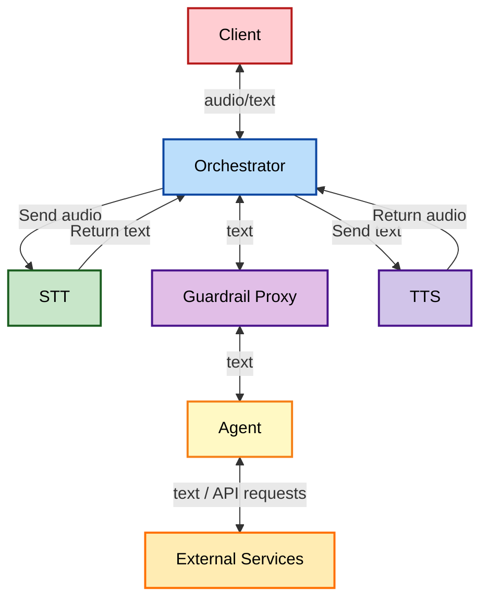
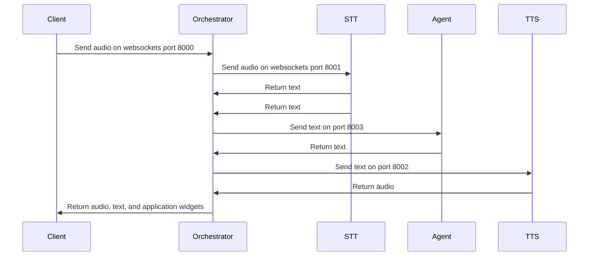

# xRx 

Build apps with "any modality input (x), reasoning (R), any modality output (x)." 

## Introduction

xRx is a framework for building AI-powered reasoning systems that interact with users across multiple modalities, where "x" represents the flexible integration of text, voice, and other interaction forms. 

We believe that the future of software interactions lies in multimodal experiences, and xRx is at the forefront of this movement. It enables developers to build sophisticated AI systems that seamlessly integrate various input and output modalities, providing users with a truly immersive experience.

## Overview 
xRx is a set of building blocks for developers looking to build next-generation AI-powered user experiences. Whether you're developing voice-based assistants, text-based chatbots, or multimodal applications, xRx provides the building blocks you need.

## Key Features

- **Multimodal Input and Output**: Integrate audio, text, and other modalities effortlessly.
- **Advanced Reasoning**: Utilize comprehensive reasoning systems to enhance user interactions.
- **Modular Architecture**: Easily extend and customize components to fit your specific needs.

<strong>System Architecture</strong>

The xRx system is composed of several key components, each playing a crucial role in delivering a seamless multimodal experience.

### High-Level Architecture
xRx includes xrx-core, which is a set of containers that provide the core functionality of the system reusable across different applications, and sample-apps, which are example applications that demonstrate how to use xrx-core.

#### Application
This code is application-specific.
- **Client**: Front-end app rendering UI and handling WebSocket communication.
- **Reasoning Agent**: Processes inputs and generates responses.

#### xRx Core
This code is reusable across applications.
- **Orchestrator**: Manages data flow between components.
- **STT (Speech-to-Text)**: Converts audio to text.
- **TTS (Text-to-Speech)**: Converts text to audio.
- **React xRx Client Library**: Reusable UI components and utilities.
- **xRx Agent framework**: Foundation for building reasoning agents.
- **Guardrails Proxy**: A safety layer for the reasoning system.

These components then communicate via the following sequence diagram

---

<strong>Reasoning Apps</strong>

### Check out the Sample Apps
xRx core is meant to be imported as a submodule into your project. Check out the [Sample-apps repository](https://github.com/8090-inc/xrx-sample-apps) for how to set up xRx core in your project.

To showcase the capabilities of xRx, we've created multiple reasoning applications:

- **Simple Tool Calling App**: For developers looking to create their own reasoning apps, we've created [Simple App](https://github.com/8090-inc/xrx-sample-apps/tree/develop/simple-app). Simple App is a simple tool calling app that demonstrates basic functionality. This App has access to tools like weather and time retrievers, and stock price lookup. It shows how any Python-based reasoning App can be deployed into the xRx system.

- **Shopify App**: We have built a sophisticated reasoning system that interacts with a Shopify store. The [Shopify App](https://github.com/8090-inc/xrx-sample-apps/tree/develop/shopify-app) allows users to interact with a reasoning system built on top of Shopify, handling tasks like product inquiries, order placement, and customer service.

- **Wolfram Assistant App**: The [Wolfram Assistant App](https://github.com/8090-inc/xrx-sample-apps/tree/develop/wolfram-assistant-app) leverages Wolfram Alpha's conversational API to provide answers to user queries, particularly useful for mathematical and scientific questions. This App enhances the dialogue with refined language processing to deliver a smooth and engaging user experience.

- **Patient Information App**: The [Patient Information App](https://github.com/8090-inc/xrx-sample-apps/tree/develop/patient-information-app) is designed to collect and manage patient information before a doctor's visit. It demonstrates how xRx can be applied in healthcare scenarios, gathering essential medical data in a conversational manner.

<strong>Contributing</strong>

We welcome contributions from the community. Whether you're adding new features, fixing bugs, or improving documentation, your efforts are valued.

For more information on contributing, see our [Contribution Guide](./contributing.md).

---

<strong>Documentation</strong>

See our documentation [here](https://8090-inc.github.io/xrx-core/)

