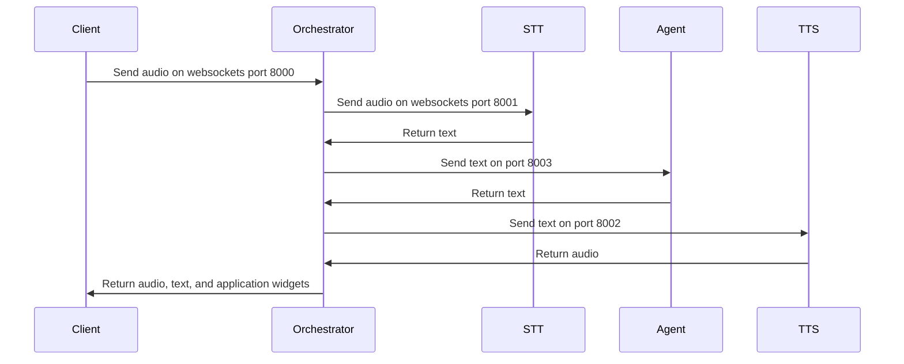

# API Design

## Overview

This document describes the communication flow between various components in the system, including the front end, orchestrator, reasoning agent, TTS (Text-to-Speech), and STT (Speech-to-Text) services. The orchestrator is the central component that manages WebSocket connections and coordinates communication between the front end, STT, TTS, and reasoning agent services. All of these communication flows can be visualized by the sequence diagram below.



## Components

The xRx system is designed with a modular architecture, separating the core framework from specific applications. This design allows for greater flexibility and customization in application development.

### Application
The application houses all the application-specific code. This structure ensures efficient development and maintenance of the application functionality.

- #### Front End (Client)
  The front end is a Next.js client that interacts with the orchestrator via WebSocket connections. It sends user inputs (text or audio) and receives responses (text or audio) from the orchestrator.
- #### Reasoning Agent
  The reasoning agent processes user inputs and generates appropriate responses. It communicates with the orchestrator via HTTP requests which produce event streaming outputs via POST requests. The server is implemented using FastAPI in Python.

### xRx Core
The xRx Core contains the essential components that form the foundation of the xRx system. These components are designed to be reusable across different applications.

- #### Orchestrator
  **[Container]** The orchestrator is a Fastify server that manages WebSocket connections with the front end and coordinates communication with the STT, TTS, and reasoning agent services.

- #### TTS (Text-to-Speech)
  **[Container]** The TTS service converts text responses from the reasoning agent into audio. It communicates with the orchestrator via WebSocket connections. The server is implemented using FastAPI in Python.

- #### STT (Speech-to-Text)
  **[Container]** The STT service converts audio inputs from the front end into text. It communicates with the orchestrator via WebSocket connections. The server is implemented using FastAPI in Python.

- #### React xRx Client Library
  **[Library]** A reusable React library that provides UI components and utilities for building the front-end of xRx-powered applications. It can be imported into each specific app to streamline development.

- #### Agent Framework
  **[Library]** A reusable library that provides the foundation for building reasoning agents. It includes common functionalities and structures that can be extended and customized for specific application needs.

These components are either containerized modules (like TTS, STT, Orchestrator) defined as separate Docker containers, or reusable libraries (like react-xrx-client and agent_framework) that can be imported into specific applications. This modular structure allows developers to easily customize and extend xRx for their specific needs while benefiting from a solid, tested foundation.

## Communication Flow

The communication flow between the components is designed to ensure seamless interaction and response generation. Below is a detailed breakdown of the communication steps and the data fields involved.

### 1. User Input

When a user interacts with the front end, they can provide input in two forms: text or audio.

- **Text Input**: The front end sends a text message to the orchestrator via WebSocket.
  - **Field**: `content`
  - **Type**: `string`
  - **Description**: The text message input by the user.
- **Audio Input**: The front end sends an audio message to the orchestrator via WebSocket.
  - **Field**: `audio`
  - **Type**: `Buffer`
  - **Description**: The audio message input by the user.

### 2. Orchestrator Handling

Upon receiving the user input, the orchestrator processes it based on its type.

- **Text Input**: The orchestrator appends the text message to the chat history and sends it to the reasoning agent.
- **Audio Input**: The orchestrator sends the audio message to the STT service for transcription.
  - **Field**: `audio`
  - **Type**: `Buffer`
  - **Description**: The audio message to be transcribed.

### 3. STT Service

The STT service is responsible for converting audio inputs into text.

- The STT service transcribes the audio message into text and sends it back to the orchestrator via WebSocket.
  - **Field**: `transcription`
  - **Type**: `string`
  - **Description**: The text transcription of the audio message.

### 4. Reasoning Agent

The orchestrator then forwards the processed input to the reasoning agent for generating a response.

- The orchestrator sends the chat history (including the transcribed text) to the reasoning agent via an HTTP POST request.
  - **Conversational History**
    - **Field**: `messages`
    - **Type**: `ChatMessage[]`
    - **Description**: The chat history including the latest user input.
  - **Session Data**
    - **Field**: `session`
    - **Type**: `{ [key: string]: string }`
    - **Description**: Session-specific data to maintain context.
  - **Action**
    - **Field**: `action` (Optional)
    - **Type**: `object`
    - **Description**: Specific actions to be performed by the agent. These "actions" map to "tools in the agent.
- The reasoning agent processes the input and generates a response, which it sends back to the orchestrator.
  - **Reasoning Agent Response**
    - **Field**: `response`
    - **Type**: `string`
    - **Description**: The response generated by the reasoning agent.
  - **Updated Session Data**
    - **Field**: `session`
    - **Type**: `{ [key: string]: string }`
    - **Description**: Updated session-specific data. For example (a new cart ID)

### 5. TTS Service

If the response from the reasoning agent is in text form and needs to be converted to audio, the orchestrator utilizes the TTS service.

- The orchestrator sends the text to the TTS service via WebSocket.
  - **Field**: `text`
  - **Type**: `string`
  - **Description**: The text message to be converted to audio.
- The TTS service converts the text to audio and sends it back to the orchestrator via WebSocket.
  - **Field**: `audio`
  - **Type**: `Buffer`
  - **Description**: The audio version of the text message.

### 6. Response to Front End

Finally, the orchestrator sends the response back to the front end, which can be in text or audio form.

- **Text Response**: The orchestrator sends the text response from the reasoning agent to the front end via WebSocket.
  - **Field**: `content`
  - **Type**: `string`
  - **Description**: The text response from the reasoning agent.
- **Audio Response**: The orchestrator sends the audio response from the TTS service to the front end via WebSocket.
  - **Field**: `audio`
  - **Type**: `Buffer`
  - **Description**: The audio response from the TTS service.

## Environment Variables

The orchestrator and other services use environment variables to configure hostnames, ports, and paths for communication. These variables are defined in a `.env` file. Each application's `.env` file contains all the necessary environment variables for that specific service.

### Example Environment Variables

```env
STT_HOST=xrx-stt
STT_PORT=8001
STT_PATH=/api/v1/ws

TTS_HOST=xrx-tts
TTS_PORT=8002
TTS_PATH=/api/v1/ws

AGENT_HOST=xrx-reasoning
AGENT_PORT=8003
AGENT_PATH=/run-reasoning-agent
```

## Conclusion

This document provides an in-depth overview of how the various components in the system communicate with each other, including the specific data fields, their types, and why they are needed. The orchestrator plays a central role in managing WebSocket connections and coordinating communication between the application (frontend and reasoning),  STT, and TTS.
