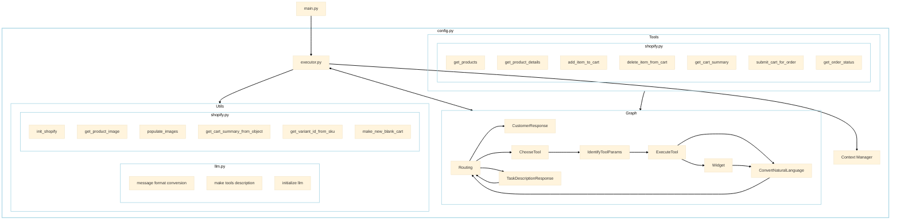
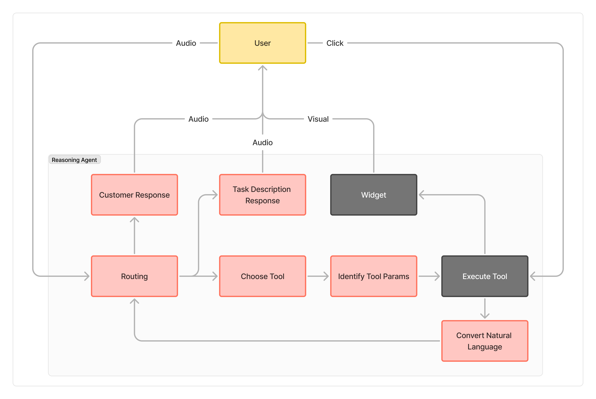

# Graph Agents: Shopify app

The significantly more advanced reasoning application in the xRx system is an agent that interacts with a Shopify store with dummy data. The agent is in charge of helping a customer go through a simple online order workflow. Basic concepts like carts, products, and orders are used through Shopify to facilitate this interaction.

## Designing Human Interactions

When designing and developing this agent, other than table stakes software principles (modularity, cost, etc.) the core design principle we strive for with xRx is providing "human-like interaction".

The Shopify application is designed to be highly interactive to the end user in the xRx system. Chatting with LLMs text does not cut it for passing the bar of "human-like" outside of trivial interfaces. By including voice in the experience, an AI system can sound like a human, but the interactions tend to miss common nuances about how people like us have a normal conversation in a customer support setting.

Here are a few ways we addressed this design principle...

**Groq for Inference**

A common complaint with agent systems in applications is that they are "too slow" for real time user interaction. This tends to happen for a few reasons. First is inference speed for LLMs capable of reasoning through problems. We try and reduce this bottleneck as much as possible by using Groq for extremely fast inference.

**Acknowledgement of Actions**

Let's take an example to explain this: Ordering food at a restaurant. When you are ordering, there are many queues that humans pick up on that the waiter is performing actions to help you. For instance, you might see the waiter write down your order; the waiter might nod when you ask for an alteration; the waiter might run to the back to ask the kitchen a question. You innately understand these actions without the need for the waiter to explain them to you each time.

The core problem boils down to a simple question: *How do you embed these human queues into a software powered by an LLM?*

Our Shopify agent tackles this challenge through visual and audio queues. First, when requests are going to be using tools, the agent has a node in the graph which runs in parallel to the tool calling and analysis which is only responsible for telling the user what is going on through an audio modality. The need for this node arises from the need for immediate responses to the end user when multiple turns on an LLM are going to need to be executed in order to respond to what the user said. Even with using Groq for inference, these requests can take many seconds to run.

Second, when specific tools are called by the agent, the xRx system will display visual widgets to the user in the front end which are relevant to whatever the user said. For example, if a customer asks "what kind of wing sauces do you have", it is a much better experience to simply display a list with prices compared to listing them off via audio. 

The overall flow of information might display as follows...

* *User via Audio:* What kind of wing sauces do you have?
* *Assistant via Audio:* One sec I'll check our options today
* *Assistant via App Visual:* [widget appears on screen with options]
* *Assistant via Audio:* Any of these look good to you?
* *User via Audio:* Yeah I'll get 6 lemon garlic and 12 hot buffalo
* *Assistant via Audio:* Let me add those to your order quick
* *Assistant via App Visual:* [widget appears on screen with current order including items and price]
* *Assistant via Audio:* Anything else today?

**Multiple User Interaction Paradigms**

When thinking about how common ways users interact with applications, the vast majority of interactions are simply "clicks". Our Shopify agent strives to take advantage of this easy way to interact with a language model by allowing users not only to speak to the reasoning system, but also have the reasoning system interpret the actions which the user takes in the application. A simple way users can interact with the Shopify agent is by clicking on menu items to add them to their order when the agent provides menu items. For example, the flow above might change to...

* *User via Audio:* What kind of wing sauces do you have?
* *Assistant via Audio:* One sec I'll check our options today
* *Assistant via App Visual:* [widget appears on screen with options]
* *Assistant via Audio:* Any of these look good to you?
* *User via Click:* [clicks 6 lemon garlic wings]
* *Assistant via App Visual:* [widget appears on screen with current order including items and price]
* *Assistant via Audio:* Anything else today?

## Technical Implementation

Now lets dive into how this all works on the backend. The Shopify reasoning agent is a tool calling agent which has been well documented in the LLM agent space. The execution paradigm is an asynchronous graph where each node determines which subsequent node(s) to traverse to based on its outcome. These nodes might be a single call to an LLM, multiple calls to an LLM, or simple python code which calls no LLMs.




Let's dive into the specifics of how these components are constructed...

### Graph Execution

The graph structure follows the flow which is shown in the diagram below. Each node is a different process. The red notes like "Routing" call an LLM. The grey nodes like "Widget" are simple python functions which do not call an LLM.




#### Graph definition

We have used the `networkx` Python library for our graph implementation. It provides a low level graph abstraction where we do not have to rewrite how to perform graph operations in Python. However, it provides enough flexibility to pass information between nodes without any inhibitions.

The base implementation of the graph classes can be viewed [here](https://github.com/8090-inc/xrx/blob/main/reasoning/shopify-agent/app/agent/graph/base.py).

#### Nodes

Each node in the agent graph is defined with two required functions.

The `process` function is the function which executes when the node is triggers. This is where any calls to an LLM are located. The output of the `process` function will then yield an output dictionary with will contain an "output" which will determine the next node to traverse to.

After the `process` function is called a `get_successors` node is called in order to determine what the next actions are. The `get_successors` function will return a list of node names which should be triggered and any inputs which should be sent to those nodes.

The nodes which are used in the reasoning system are available [here](https://github.com/8090-inc/xrx/blob/main/reasoning/shopify-agent/app/agent/graph/nodes/).

Here is the list of nodes which are available in the graph today.

* `Routing`: Determines the next action based on the current state and conversation context.
* `TaskDescriptionResponse`: Generates a brief, personalized waiting message for the customer.
* `ChooseTool`: Selects the appropriate tool to use based on the current task.
* `IdentifyToolParams`: Identifies and prepares the parameters needed for the selected tool.
* `ExecuteTool`: Executes the selected tool with the prepared parameters.
* `Widget`: Displays relevant visual widgets to the user in the front end.
* `ConvertNaturalLanguage`: Converts tool outputs into natural language descriptions.

### Tools

All the tools available to the agent are defined as simple python functions which reach out to Shopify via the Python SDK. These tools can be seen [here](https://github.com/8090-inc/xrx/blob/main/reasoning/shopify-agent/app/agent/tools). They follow the general code format shown below.

```python
@observability_decorator(name='my_tool')
def my_tool(arg1: str):
    """
    Doc string with description, when to use, arguments, and outputs
    """
    your_code = ''
    return your_code
```

It is very important to note that these doc strings are used in the prompt for the agent. **This means that any change to the doc string will impact the performance of the reasoning agent.**

Please read the [observability tutorial](/docs/tutorials/setting_up_llm_observability) for more information regarding the observability decorator above.

### Passing Messages to the Frontend

The three nodes which are used to pass messages to the frontend are `Widget`, `CustomerResponse`, and `TaskDescriptionResponse`. These node names recognized by the orchestrator to determine which information the agent creates which needs to be passed to the frontend. As the graph is executed, the FastAPI streaming response will yield a dictionary which contains two specific fields.

* `node`: The name of the node which generated the output below.
* `output`: The output of the node which was executed. In the case of `Widget`, this is a JSON object which is then mapped to a rendering in the front end. In the case of the other nodes, this is a simple string which is passed to the frontend to be played as audio.

### Conversation Context

For all of the nodes, when they are executed, their output is streamed to the orchestrator container. The orchestrator container is in charge of maintaining conversational context as it happens in real time. Any information which should be persisted in the conversation history will be passed out in the `messages` field which is streamed out of the reasoning container.

There is some heavy string manipulation which happens in the reasoning system to maintain a record of this conversation history because of the various modalities which are used to interact with the user. Specifically, all the tool calls which need to be kept track of are stored in a list which is then joined into a single string and passed into the system prompt.

### Context Handling

Because the Shopify system has a session associated with the application and the user, it is important to maintain a record of the session ID and the cart ID (if there is one) in order to ensure that the user's order is being tracked correctly. This is done by the orchestrator passing the session ID and cart ID into the FastAPI endpoint which serves the reasoning agent. All inputs to the reasoning agent will have the following json structure...

```json
{
    "session": {
        "session_id": "session_id",
        "cart_id": "cart_id"
    },
    "messages": [
        {
            "role": "user",
            "content": "..."
        },
        {
            "role": "assistant",
            "content": "..."
        },
        {
            "role": "user",
            "content": "..."
        }
    ]
}
```

Once the orchestrator passes in the session and messages, the reasoning agent will use the `messages` field to determine the conversation history and the `session` field to determine the session ID and cart ID. The session variable is then stored per execution [here](https://github.com/8090-inc/xrx/blob/main/reasoning/shopify-agent/app/agent/graph/nodes/) via the `context_manager` module. 

It is important to note that we could pass the session into each tool call. However, because each tool definition is passed into the prompt for some of the nodes in the graph, it is better to handle the session in the context manager as to not introduce more inputs to the tool call function which need to be understood by the LLM.

Here is an example of how the session data is set and retrieved within a given context. Notice how `my_function` can be called and retrieve the `session_data` without needing an explicit input argument.

```python
from context_manager import set_session, session_var

def my_session_function():
    session_data = session_var.get()
    print(session_data['session_id'])
    session_data["cart_id"] = 5678
    session_var.set(session_data)
    return None

session_data = {
    "session_id": 1234
}

with set_session(session_data):
    _ = my_function()
    print(session_var.get())
```

```output
1234
{'session_id': 1234, 'cart_id': 5678}
```

For a more detailed look at this being used in action, check out the tools which are available [here](https://github.com/8090-inc/xrx/blob/main/reasoning/shopify-agent/app/agent/tools).

### Canceling an Ongoing Task

The Shopify reasoning agent supports canceling an ongoing task, which is crucial for providing a responsive user experience and managing system resources efficiently. This functionality is implemented using Redis to track the status of each task.

#### Task Execution and Cancellation Flow

1. When a new task is initiated:
   - A unique `task_id` is generated using UUID.
   - The task status is set to 'running' in Redis.
   - The `task_id` is included in the response headers as 'X-Task-ID'.

2. To cancel a task:
   - A POST request is sent to the `/cancel-reasoning-agent/{task_id}` endpoint.
   - The task status in Redis is updated to 'cancelled'.

3. During execution:
   - The agent periodically checks the task status in Redis.
   - If the status is 'cancelled', the agent will stop processing and gracefully terminate the task.

#### Redis Integration

The system uses a Redis container (xrx-redis) to store and manage task statuses. This allows for efficient, real-time status updates and checks across the distributed system.

If you are using the docker-compose setup, the Redis container will be automatically started and the reasoning agent will be able to use it as long as the environment variable is correctly set as shown below.

```
REDIS_HOST="xrx-redis"
```

If you are running the agent locally outside of docker compose, the reasoning agent will look for a Redis container on the default host (`localhost`) and port (`6379`). In order to start that server, you can use the following command:

```
docker run -d --name redis-server -p 6379:6379 redis
```

#### API Usage Example

To cancel a task, send a POST request to the cancellation endpoint:

```
POST /cancel-reasoning-agent/{task_id}
```

Example response:

```json
{
  "detail": "Task {task_id} cancelled"
}
```

If successful, this will return a 200 status code. In case of an error, it will return a 500 status code with an error message.

#### Implementation Details

The cancellation mechanism is implemented in the FastAPI application:

```python
@app.post("/cancel-reasoning-agent/{task_id}")
async def cancel_agent(task_id: str):
    try:
        await redis_client.set(task_id, 'cancelled')
        logger.info(f"Task {task_id} set to cancelled")
        return JSONResponse(content={"detail": f"Task {task_id} cancelled"}, status_code=200)
    except Exception as e:
        logger.error(f"An error occurred while cancelling the task: {str(e)}")
        return JSONResponse(content={"detail": f"An error occurred: {str(e)}"}, status_code=500)
```

This cancellation feature enhances the robustness of the Shopify reasoning agent, allowing for better control over task execution and improved user experience. It's particularly useful for long-running tasks or when the user decides to change their request mid-process.
