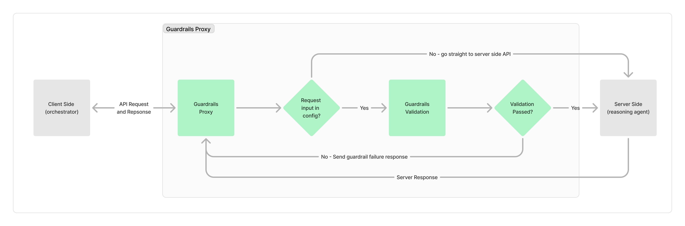

# Guardrails

The Guardrails system is a flexible and powerful API proxy that enhances security and content moderation for your applications. It leverages the Guardrails AI Hub to apply various checks and filters to incoming and outgoing data.



## Key Features

1. **Configurable API Proxy**: Can be set up to monitor any API endpoint.
2. **Guardrails AI Hub Integration**: Utilizes a wide range of pre-built and custom guardrails.
3. **Portable Design**: Can be easily integrated with any existing API.

## How It Works

### 1. API Proxy Configuration

The Guardrails proxy can be configured to intercept requests for any API endpoint. This is done through a simple configuration object:

```python
MONITOR_CONFIG = {
    "endpoint-name": {
        "input_keys": {
            "field_name": {
                "type": "data_type",
                // Additional configuration...
            }
        }
    }
}
```

This configuration tells the proxy how to extract and process data from incoming requests, allowing for flexible adaptation to different API structures.

### 2. Guardrails AI Hub Integration

The proxy leverages the Guardrails AI Hub, which provides a variety of pre-built guardrails such as:

- Toxic language detection
- PII (Personally Identifiable Information) detection
- Sentiment analysis
- Language detection
- Content classification

Custom guardrails can also be easily implemented and integrated into the system.

### 3. Portability

The Guardrails proxy is designed to be easily integrated with any existing API. It can be deployed as a separate service that sits between your clients and your main API, requiring minimal changes to your existing infrastructure.

## Implementation

1. **Request Interception**: The proxy intercepts incoming API requests.
2. **Data Extraction**: It extracts relevant data based on the configuration.
3. **Guardrails Application**: The extracted data is passed through the configured guardrails.
4. **Request Forwarding**: If all checks pass, the request is forwarded to the main API.
5. **Response Handling**: The proxy can optionally apply guardrails to the API's response as well.

## Benefits

- **Enhanced Security**: Protect your API from malicious or inappropriate content.
- **Flexibility**: Easy to configure for different endpoints and data structures.
- **Scalability**: Leverage powerful AI models without burdening your main API.
- **Customization**: Implement custom guardrails for your specific needs.

By utilizing the Guardrails proxy, you can add a robust layer of protection and moderation to any API, enhancing the security and reliability of your applications.
