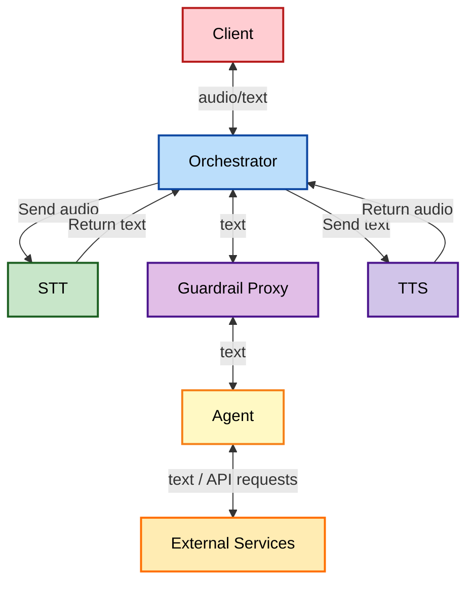
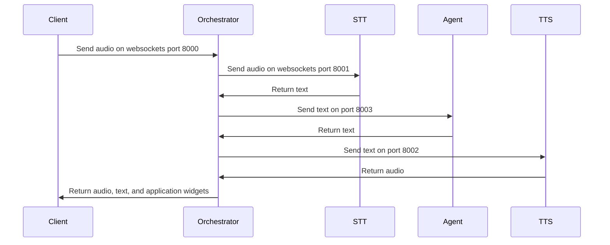

# System Architecture

## Modular Components

The xRx system architecture consists of several components that interact with each other to provide build a reasoning based application. Below is a high-level overview of the system:

- **Client**: Front end app experience which renders the UI and handles websocket communication with the Orchestrator. [See directory here](https://github.com/8090-inc/xrx/blob/main/nextjs-client)
- **Orchestrator**: Manages the flow of data between various AI and traditional software components. [See directory here](https://github.com/8090-inc/xrx/blob/main/orchestrator)
- **STT (Speech-to-Text)**: Converts audio input to text. [See directory here](https://github.com/8090-inc/xrx/blob/main/stt)
- **TTS (Text-to-Speech)**: Converts text responses back to audio. [See directory here](https://github.com/8090-inc/xrx/blob/main/tts)
- **Agent**: Responsible for the "reasoning" system of xRx. [See directory here](https://github.com/8090-inc/xrx/blob/main/reasoning/shopify-agent)
- **Guardrails Proxy**: A safety layer for the reasoning system. [See directory here](https://github.com/8090-inc/xrx/blob/main/guardrails-proxy)

## Information Flow

These components then communicate via the following sequence diagram

## Deployment Specifics

xRx's deployment is designed to be modular in nature. This means that you can swap out any component of the system with your own custom implementation. The entire system is defined as a single docker-compose file with a single connected network. This allows for easy swapping of components and deployment to a variety of different environments.

Each system component is defined as a docker image. The docker-compose file located in the application folder will then start each component and connect it to the same network.
