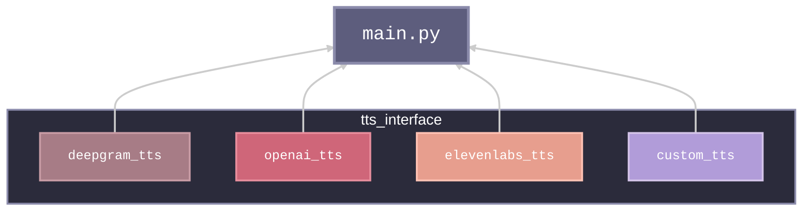

# Text-to-speech

The Text-to-Speech is a FastAPI service that converts text input into audio in a .mp3 format.

## Getting Started

### Prerequisites

Install `Docker`, `Python3` and `Pip3` with [homebrew](https://formulae.brew.sh/) on MacOS or `apt-get update` on Debian/Ubuntu based Linux systems
```bash
brew cask install docker
brew install python@3.10
```

### Structure



### Parameters and API Keys
- Set the `TTS_PROVIDER` environment variable to either 'elevenlabs', 'deepgram', 'openai', or 'cartesia' to choose the TTS provider.
- Set the `TTS_SAMPLE_RATE` environment variable to the sample rate of the TTS model. Default is 24000Hz.
- Access to Elevenlabs. The following environment variables are available for Elevenlabs API usage. Sign up at [Elevenlabs](https://elevenlabs.io/app/sign-up) to obtain the necessary keys:
    - `ELEVENLABS_API_KEY`
    - `ELEVENLABS_VOICE_ID`
    - `ELEVENLABS_MODEL_ID` (default: `eleven_turbo_v2.5`)
    - `ELEVENLABS_VOICE_STABILITY` (default: `0.9`)
    - `ELEVENLABS_VOICE_SIMILARITY` (default: `0.9`)
- Access to Deepgram TTS. The following environment variables are available for Deepgram API usage. Sign up at [Deepgram](https://deepgram.com/) to obtain the necessary keys:
    - `DG_API_KEY`
    - `DG_TTS_MODEL_VOICE` (default: `aura-asteria-en`)
- Access to OpenAI TTS. The following environment variables are available for OpenAI API usage. Sign up at [OpenAI](https://platform.openai.com/signup) to obtain the necessary keys:
    - `OPENAI_API_KEY`
    - `OPENAI_TTS_MODEL`
    - `OPENAI_TTS_VOICE`
- Access to Cartesia TTS. The following environment variables are available for Cartesia API usage. Sign up at [Cartesia](https://cartesia.ai/) to obtain the necessary keys:
    - `CARTESIA_API_KEY`
    - `CARTESIA_VOICE_ID`
    - `CARTESIA_MODEL_ID` (default: `sonic-english`)
    - `CARTESIA_VERSION` (default: `2024-06-10`)

## Technical Notes

### Input Limitations
- In [main.py](https://github.com/8090-inc/xrx/blob/main/tts/app/main.py), there is a limit set to the maximum input length sent to the TTS API, which is 4000 characters. This can be adjusted if the TTS API has smaller limits.

### Caching
- The TTS service implements a caching mechanism to improve performance.
- When a text is synthesized, the audio is cached on disk in the `cache` directory within the application folder.
- Subsequent requests for the same text will retrieve the cached audio instead of re-synthesizing it.

### Streaming Chunks
- Every TTS model is implemented with streaming capabilities to achieve extremely fast responses.
- Streaming is achieved by chunking the payload and sending each chunk as soon as it is ready. Both inputs and outputs are streamed if the API endpoint supports it.
- Cached audio files are sent back to the client in chunks of 4096 bytes.
- The chunked approach ensures efficient memory usage and maintains consistent streaming behavior, which is crucial for real-time audio playback.

---

## How To Run

### Locally with Docker
Ensure to be in the root folder `xrx`
```bash
docker build -t xrx-tts:latest .
docker run -it --rm \
--env-file ../.docker.env \
-p 8002:8002 \
xrx-tts:latest
```
Once the containers are up and running, visit the client at [http://localhost:3000](http://localhost:3000)

### Locally without Docker

#### Setup the Python Virtual Environment.
 ```
 python3 -m venv myenv
 source myenv/bin/activate
```

#### Install requirements
```bash
pip install -r requirements.txt
cd app
uvicorn main:app --reload --port 8002 --env-file ../../.env
```

##### Now you will then have a websocket server running on [http://localhost:8002/api/v1/ws](http://localhost:8002/api/v1/ws)

---

## Debug

Debugging with FastAPI CLI.

1. Install `python` and `pip`
2. Install `fastapi`
3. Launch the service through `fastapi dev app/main.py --port 8002`
4. The WebSocket will be accessible at `ws://localhost:8002/api/v1/ws`